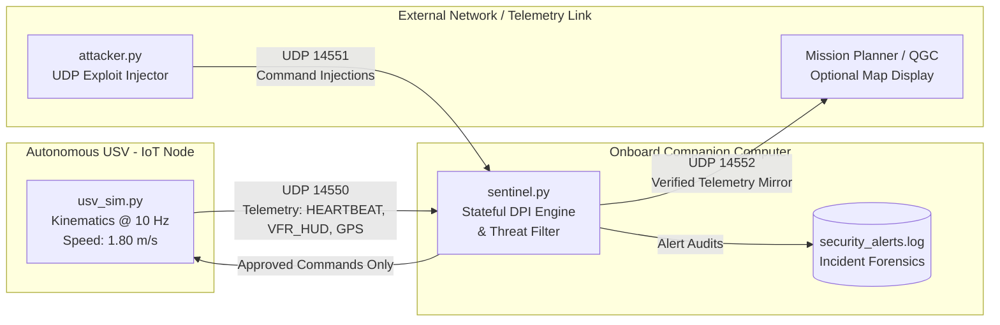

# USV-Sentinel: Stateful Telemetry Security Gateway & DPI Firewall for Autonomous Marine Vessels


An inline **Application-Layer Gateway (ALG)** and **Intrusion Prevention System (IPS)** engineered to protect Unmanned Surface Vehicles (USVs) and autonomous drones from unauthenticated MAVLink command injection over UDP telemetry links.

---

## 1. Problem Statement & Threat Model

Unmanned Surface Vehicles (USVs) operating in coastal and maritime environments rely on connectionless UDP transport for telemetry links (LTE, maritime mesh radio, or satellite). Unlike TCP, UDP avoids **Head-of-Line (HoL) blocking** and retransmission delays, ensuring real-time vehicle situational awareness.

However, standard MAVLink networks lack native link-layer authentication. An attacker on the local network or cellular subnet can inject raw UDP datagrams directly into the vehicle's telemetry stream.

### Exploited Vulnerabilities:
1. **Kinetic Disarm (Remote Engine Cutoff):** Forcing `MAV_CMD_COMPONENT_ARM_DISARM` with parameter `1=0` while the vessel is underway, causing sudden propulsion loss and drift.
2. **Autonomous Memory Erasure:** Injecting `MISSION_CLEAR_ALL` (Message ID 45) to erase autonomous waypoint navigation plans.
3. **Spatial Hijacking (Geofence Breach):** Injecting spoofed `MISSION_ITEM` coordinates to divert the vessel outside authorized operational sectors.

---

## 2. System Architecture

`USV-Sentinel` operates as an inline proxy between external communication links and the vessel's internal flight controller.



### Port Mapping Topology:
| Port | Protocol | Source | Destination | Purpose |
| :--- | :--- | :--- | :--- | :--- |
| **14550** | UDP | `usv_sim.py` | `sentinel.py` | Raw vehicle telemetry stream |
| **14551** | UDP | `attacker.py` | `sentinel.py` | External command intake / attack vector |
| **14552** | UDP | `sentinel.py` | Mission Planner | Optional verified GCS telemetry mirror |

---


## 3. Quickstart & Reproducibility

### Prerequisites
* Windows, Linux, or macOS
* Python 3.9+
* `pymavlink`

```bash
pip install pymavlink
```

### Execution Steps
Open three terminal windows inside the `src/` directory:

```bash
# Terminal 1: Launch the Virtual USV IoT Node (Cruises autonomously at 1.80 m/s)
python usv_sim.py

# Terminal 2: Launch the USV-Sentinel Security Gateway
python sentinel.py

# Terminal 3: Fire the Exploit Suite
python attacker.py
```


---

## 4. Author & Engineering Context
Engineered by a Software Engineer & Cybersecurity Student specializing in autonomous surface vessels (USVs), embedded IoT communication pipelines, and cyber-physical security systems.
